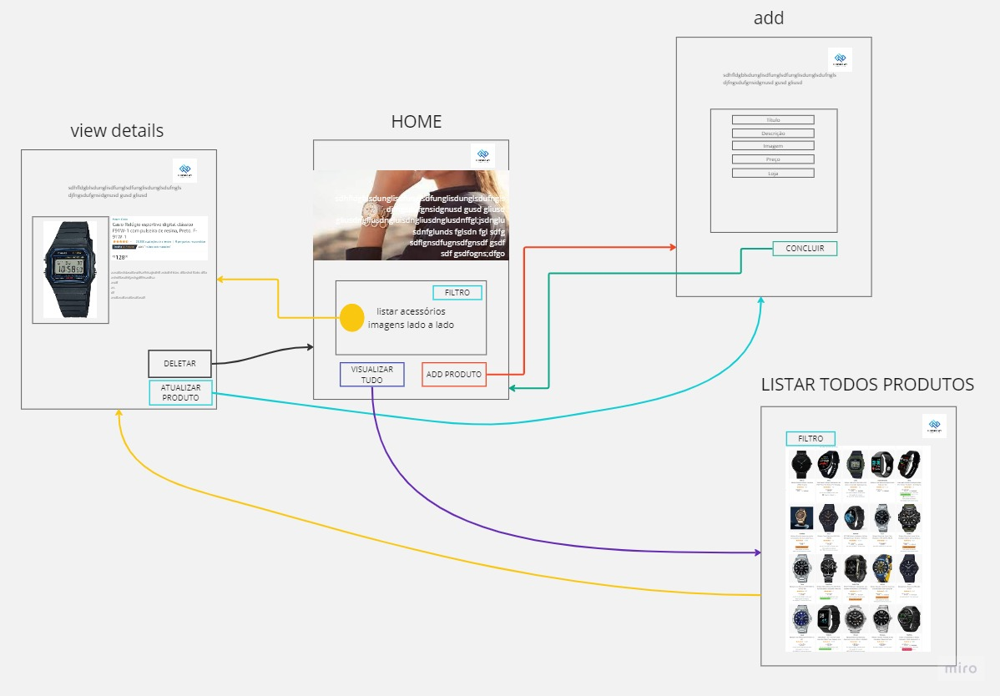

# MongoDB

## Trabalho final

Loja de acessórios 

[Link do Banco de dados](https://data.world/crowdflower/wearable-technology-database) 

Esquema de paginas 

Alunos :
 - Ana Rachel 
 - João Lucas

    else :
        updated_document = {
            "Name" : request.form['nome'],
            "Company" : {
                "Name" : request.form['marca']} ,
            "Category" : request.form['categoria'],
            "Price" : request.form['preco'],
            "Body" : {
                "Location" : request.form['localizacao']} ,
            "Imagem" : request.form['imagem'],
            "Observations" : request.form['obs']
        }
        collection.update_one({"_id" : ObjectId(id)}, {"$set" : updated_document })
        return redirect(url_for("produto_details", id = id))